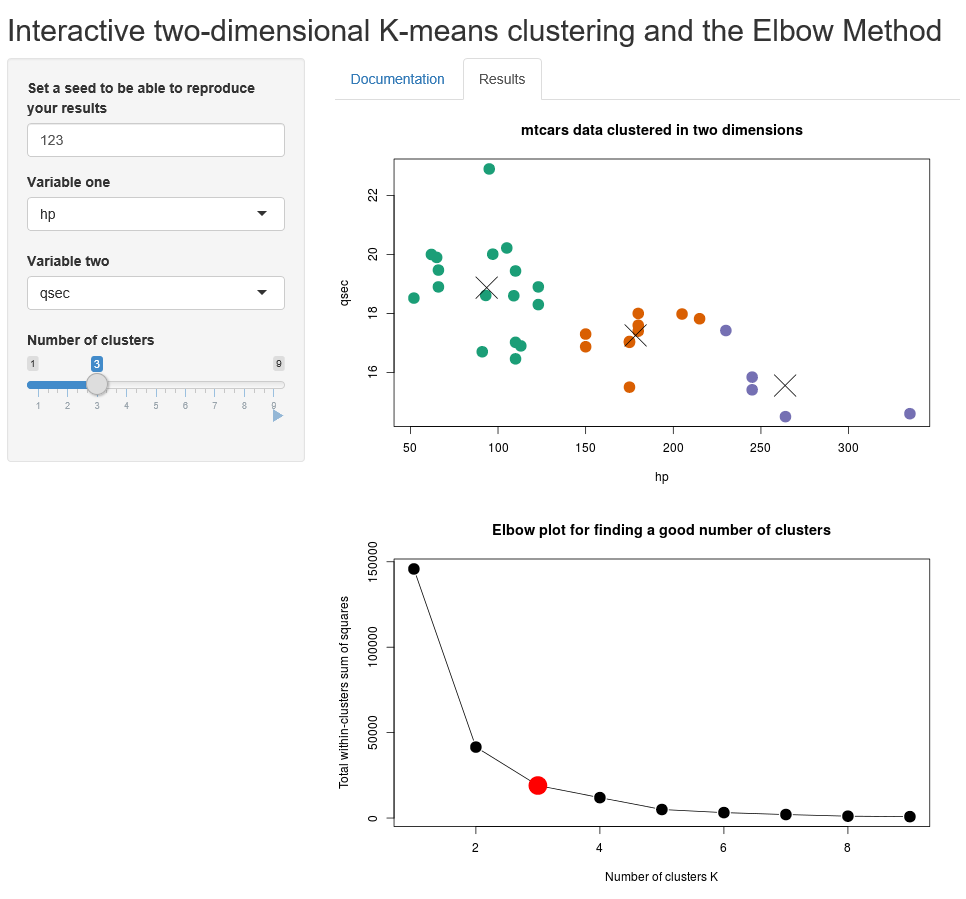
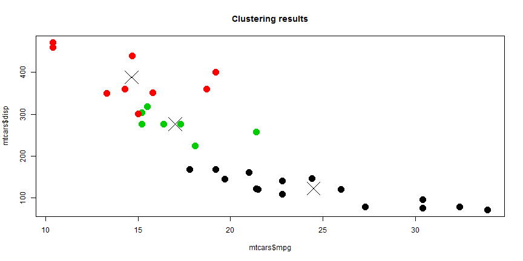
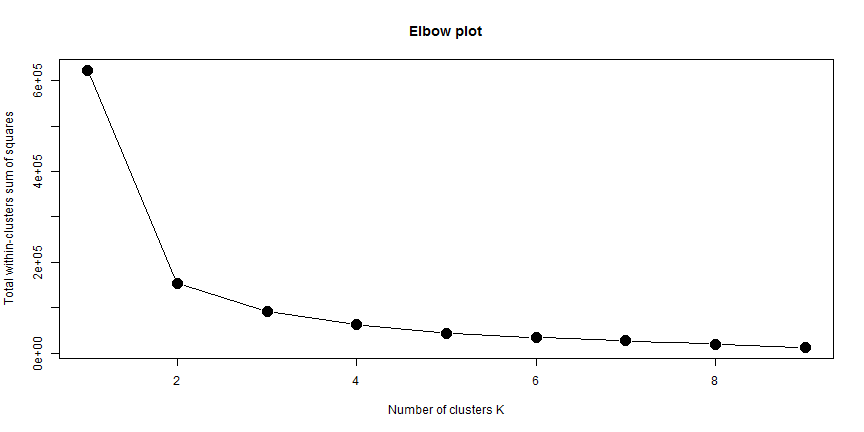

An app for playing with K-means clustering
========================================================
author: Olga Hartoog
date: 30 May 2018
autosize: true

Introduction
========================================================

The K-means algorithm is one of the most well known methods for clustering. Clustering is an unsupervised machine learning algorithm that groups items together based on their proporties. The groups are not defined beforehand, but the number of clusters is.

Visualisation helps in understanding how the algorithm works, which is the purpose of our [app](https://ohartoog.shinyapps.io/k-means_and_elbow_method_app/). The app lets you cluster the mtcars dataset on two dimensions at the time, and you can play with the number of clusters, while seeing the results in real-time




K-means clustering in practice: running the algorithm
========================================================
Below we show how you can do a simple K-means clustering in R. For this we use the standard mtcars dataset. We choose to cluster on all dimensions and make 3 clusters.

```r
# Choose a number of clusters
k <- 3

# Set a randomization seed to make results reproducible
set.seed(123)

# Run the clustering algorithm
clusters <- kmeans(mtcars, k)
```

K-means clustering in practice: plotting the results 
========================================================
In order to see what is happening, we are plotting the result of the clustering in the dimensions mpg and disp. We add crosses to indicate the centers of the clusters. 

```r
# Plot the data points color coded by their cluster
plot(mtcars$mpg,mtcars$disp,col=clusters$cluster,pch = 20, cex = 3, main = "Clustering results")

# Pick only the mpg and disp values
centers <- cbind(clusters$centers[,1],clusters$centers[,3])

# Overplot the centers of the clusters
points(centers, pch = 4, cex = 4)
```


The Elbow method
========================================================
In the previsous example we forced the algorithm to come up with 3 clusters. Usually it is not obvious what the number of clusters should be for helping you further with your problem. The Elbow Method can be a useful tool for this. 

The Elbow plots shows the total within-clusters sum of squares against the number of clusters. This number is decreasing with number of clusters, but at some point, the gain is not 'worth' the increased complexity of the model anymore. This is where the plot shows an angle, or 'elbow', indicating the ideal number of clusters.

For this problem, we see that 3 clusters is not really justified, and 2 clusters would be a better solution.



